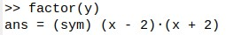
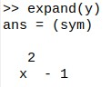
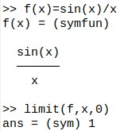
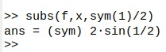
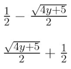

# A tutorial on the gnu-octave/symbolic package

---

First we load the symbolic package by typing the following in the octave command window:

	pkg load symbolic

and then we can define a symbolic variable.

	syms x

If needed, more symbolic variables can be added as a list, separating them with spaces. 

If we enter the following quadratic equation

	y=x^2-x-1 

we can solve it, or find the values of x for which y=0 (the roots).

	solve(y,x)

This shows the output of these steps:

The two resulting solutions have been put in a column matrix. We can convert these to numerical values with:

	double(ans) 

 which gives the two solutions in double precision: -0.6180 and 1.6180, the latter being the <i>Golden Ratio</i>. 
 
 Now consider another golden oldie, the difference of two squares: 
 
	y=x^2-4

We can factorise this expression with

	factor(y)

which gives us:

We can multiply bracketed terms such as:

	y=(x+1)*(x-1)

with *expand(y)* or *simplify(y)* which give us:

Consider the trigonometric function: 

	f=tan(x) 

where x is in radians. We can differentiate this with respect to x as follows:

	diff(f,x)

which gives us the following: 

 

The equivalent trigonometric function for angles in degrees is: 

	f=tand(x)
	
which octave symbolically expands as follows:

We can integrate this over the range of x=0 to x=45 degrees as follows: 
	
	int(f,x,0,45)

As before, we can convert this to a numerical answer (19.86) with: 

	double(ans) 

Like de l'H&#244;pital, we can do limits, too. The following evaluates a function as the variable (x) tends to zero. 

 

If we want to substitute a symbolic value such as a fraction e.g. x=&#189; into this equation, we need to define at least the numerator of the fraction as a symbol. 

 

We can do Taylor (or Maclaurin) expansions. Here is an interesting one from [mathisfun.com](https://www.mathsisfun.com/algebra/taylor-series.html)  which does not have the usual factorial terms (2!, 4! etc) in the output. 

 

Note this formula only works when |x| is less than 1. It is a good exercise to work out where the factorials have gone! 

We can list the terms of the expansion with the powers of x increasing, rather than decreasing, as below: 

 

---

**Matrix operations** can be done, noting that we need to start each new row of a matrix with a semicolon. The following shows a classic matrix inversion. 

 

Note that pre- or post-multiplying a matrix by its inverse should generate the identity matrix and we can see this below, providing we apply the simplify method (expand does not work here). 

 

---

**Rearranging equations** can also be done using the solve method. For example with the below quadratic equation for y as a function of x:
 
	y=x^2-x-1 

we can rearrange it to obtain x as a function of y. To do this we need to enter it into the solve function in this alternative form:
 
	y-x^2+x+1=0 

as follows:

	solve(y-x^2+x+1,x)

and this is the output.

 

Note the \/ symbols mean a big square root sign i.e. everything in the numerator is square-rooted. If these do not display properly, please experiment with the command window font. If we enter: 

	latex(ans)

we get the relevant latex code that can be copied and pasted into a suitable viewer or editor to display the equations properly, as below.

 

Actually, it wasn't strictly necessary to swap the terms in the equation first because we could have achieved the same thing with the expression: 

	solve(y==x^2-x-1,x)

Note the double equals sign indicating that the program is doing a logical test for equality. 

This has been a tutorial on the Octave Symbolic package which uses the excellent SymPy package as its workhorse. 

---

**References** 

*Introduction to GNU Octave. A brief tutorial for linear algebra and calculus students*. Jason Lachniet. (2017). Wytheville Community College, Open Library textbook. [https://open.umn.edu/opentextbooks/textbooks/557](https://open.umn.edu/opentextbooks/textbooks/557) 

  Gnu Octave Symbolic function reference: [https://octave.sourceforge.io/symbolic/overview.html](https://octave.sourceforge.io/symbolic/overview.html) 