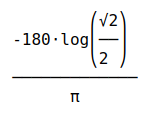
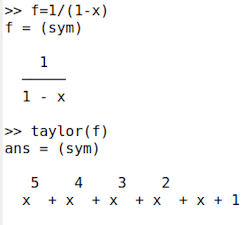
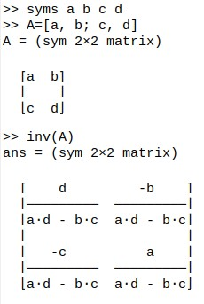
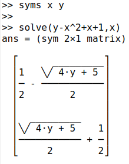
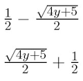

# A tutorial on the gnu-octave/symbolic package

---

First we load the symbolic package by typing the following in the octave command window:

	pkg load symbolic

and then we can define a symbolic variable.

	syms x

If needed, more symbolic variables can be added as a list, separating them with spaces. 

If we enter the following quadratic equation

	y=x^2-x-1 

we can solve it, or find the values of x for which y=0 (the roots).

	solve(y,x)

This shows the output of these steps:

The two resulting solutions have been put in a column matrix. We can convert these to numerical values with:

	double(ans) 

 which gives the two solutions in double precision: -0.6180 and 1.6180, the latter being the <i>Golden Ratio</i>. 
 
 Now consider another golden oldie, the difference of two squares: 
 
	y=x^2-4

We can factorise this expression with

	factor(y)

which gives us:

We can multiply bracketed terms such as:

	y=(x+1)*(x-1)

with *expand(y)* or *simplify(y)* which give us:

Consider the trigonometric function: 

	f=tan(x) 

where x is in radians. We can differentiate this with respect to x as follows:

	diff(f,x)

which gives us the following: 

 

The equivalent trigonometric function for angles in degrees is: 

	f=tand(x)
	
which octave symbolically expands as follows:

We can integrate this over the range of x=0 to x=45 degrees as follows: 
	
	int(f,x,0,45)

As before, we can convert this to a numerical answer (19.86) with: 

	double(ans) 

Like de l'H&#244;pital, we can do limits, too. The following evaluates a function as the variable (x) tends to zero. 

 

If we want to substitute a symbolic value such as a fraction e.g. x=&#189; into this equation, we need to define at least the numerator of the fraction as a symbol. 

 

We can do Taylor (or Maclaurin) expansions. Here is an interesting one from [mathisfun.com](https://www.mathsisfun.com/algebra/taylor-series.html)  which does not have the usual factorial terms (2!, 4! etc) in the output. 

 

Note this formula only works when x is less than 1. It is a good exercise to work out where the factorials have gone. 

---

**Matrix operations** can be done, noting that we need to start each new row of a matrix with a semicolon. The following shows a classic matrix inversion. 

 

Note that pre- or post-multiplying a matrix by its inverse should generate the identity matrix and we can see this below, providing we apply the simplify method (expand does not work here). 

 

---

**Rearranging equations** can also be done using the solve method. For example with the below quadratic equation for y as a function of x:
 
	y=x^2-x-1 

we can rearrange it to obtain x as a function of y. To do this we need to enter it into the solve function in this alternative form:
 
	y-x^2+x+1=0 

as follows:

	solve(y-x^2+x+1,x)

and this is the output.

 

Note the \/ symbols mean a big square root sign i.e. everything in the numerator is square-rooted. If these do not display properly, please experiment with the command window font. If we enter: 

	latex(ans)

we get the relevant latex code that can be copied and pasted into a suitable viewer or editor to display the equations properly, as below.

 

This has been a tutorial on the Octave Symbolic package which uses the excellent SymPy package as its workhorse. 

---

**References** 

*Introduction to GNU Octave. A brief tutorial for linear algebra and calculus students*. Jason Lachniet. (2017). Wytheville Community College, Open Library textbook. [https://open.umn.edu/opentextbooks/textbooks/557](https://open.umn.edu/opentextbooks/textbooks/557) 

  Gnu Octave Symbolic function reference: [https://octave.sourceforge.io/symbolic/overview.html](https://octave.sourceforge.io/symbolic/overview.html) 